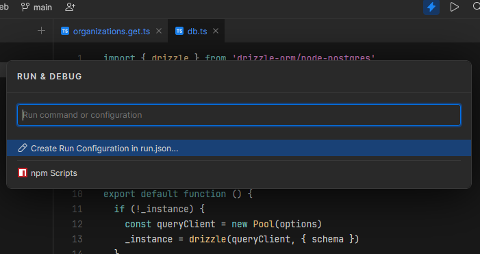

Most editors come with the play button on the status bar to start up your app. And the one with the bug on it, to run in debug mode. So how do we make sure that those fancy buttons work for your Nuxt project on Jetbrains Fleet

<!-- more -->

# Nuxt Run Configurations On Fleet

Make sure the project in open on your fleet editor. Then just press play!

This will open a dialog like below:


Well from there you either start adding code with help from the following snipped or just copy paste and call it a day.

```json
{
  "configurations": [
    {
      "type": "node",
      "name": "server: nuxt",
      "file": "./node_modules/nuxi/bin/nuxi.mjs",
      "appOptions": [
        "dev"
      ]
    }
  ]
}
```
Now, you can debug and put breakpoints all over your ide and have a blast steping over your weird code.

well... thats it. There's nothing more to it. This is the end of this post. 

Bye!